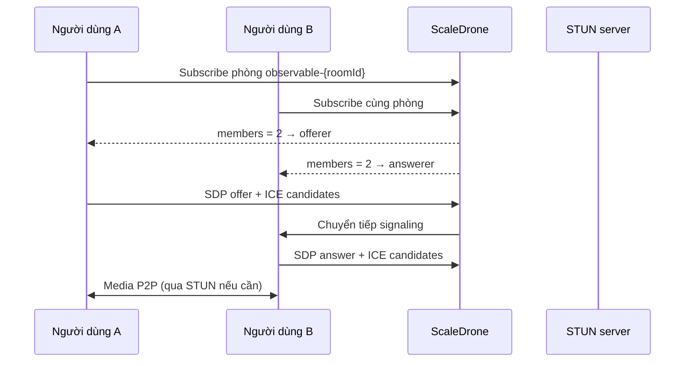

# WeRTC — VideoCall

Ứng dụng gọi video trực tuyến peer-to-peer, chạy hoàn toàn trên trình duyệt. Người dùng tạo hoặc tham gia phòng bằng mã phòng, chia sẻ liên kết và gọi video 1–1 mà không cần cài đặt phần mềm.

## Tính năng

- **Tạo phòng mới** — sinh mã phòng ngẫu nhiên và chuyển thẳng vào cuộc gọi
- **Tham gia phòng** — nhập mã phòng do người tạo phòng chia sẻ
- **Gọi video WebRTC** — truyền audio/video trực tiếp giữa hai trình duyệt
- **Điều khiển cuộc gọi** — bật/tắt camera, microphone; kết thúc cuộc gọi
- **Sao chép mã phòng** — nút copy trên màn hình gọi để mời người khác
- **Phím tắt** — `V` (camera), `M` (microphone) khi đang trong phòng gọi

## Công nghệ

| Thành phần | Mô tả |
|------------|--------|
| [WebRTC](https://developer.mozilla.org/en-US/docs/Web/API/WebRTC_API) | Truyền media và kết nối P2P |
| [ScaleDrone](https://www.scaledrone.com/) | Kênh signaling (SDP, ICE candidate) |
| STUN (`stun.l.google.com`) | Hỗ trợ NAT traversal |
| HTML / CSS / JavaScript | Giao diện và logic phía client |

## Cấu trúc thư mục

```
WeRTC/
├── index.html      # Trang chủ — tạo / tham gia phòng
├── call.html       # Trang cuộc gọi video
├── welcome.js      # Logic trang chủ
├── call.js         # Logic WebRTC và điều khiển cuộc gọi
├── styles.css      # Giao diện chung
└── script.js       # Phiên bản logic cũ (tham khảo)
```

## Yêu cầu

- Trình duyệt hiện đại (Chrome, Firefox, Edge, Safari) hỗ trợ WebRTC
- Quyền truy cập **camera** và **microphone**
- Kết nối Internet (cho signaling qua ScaleDrone và STUN)
- Trang nên được phục vụ qua **HTTP/HTTPS** (không mở file trực tiếp `file://` nếu trình duyệt chặn `getUserMedia`)

## Cài đặt và chạy

1. Clone repository:

```bash
git clone <url-repo>
cd WeRTC
```

2. Chạy một static server cục bộ (ví dụ):

```bash
# Python 3
python -m http.server 8080

# hoặc Node.js (npx, không cần cài global)
npx serve .
```

3. Mở trình duyệt tại `http://localhost:8080` (hoặc cổng tương ứng).

4. Trên trang chủ:
   - Chọn **Tạo phòng ngay** để tạo phòng mới, hoặc
   - Chọn **Tham gia phòng**, nhập mã phòng rồi **Tham gia ngay**.

5. Chia sẻ **mã phòng** (hoặc URL dạng `call.html#<mã-phòng>`) cho người còn lại. Khi có đủ 2 người trong phòng, cuộc gọi video sẽ được thiết lập.

## Cấu hình ScaleDrone

Signaling dùng [ScaleDrone](https://www.scaledrone.com/). Channel ID mặc định nằm trong `call.js`:

```javascript
const drone = new ScaleDrone('yiS12Ts5RdNhebyM');
```

Để dùng kênh riêng:

1. Đăng ký tài khoản tại [scaledrone.com](https://www.scaledrone.com/).
2. Tạo channel mới và lấy **Channel ID**.
3. Thay `'yiS12Ts5RdNhebyM'` trong `call.js` bằng Channel ID của bạn.

Tên phòng trên ScaleDrone có tiền tố `observable-` kèm mã phòng từ URL hash.

## Luồng hoạt động (tóm tắt)



## Lưu ý

- Ứng dụng được thiết kế cho **cuộc gọi 1–1** trong một phòng.
- Chỉ dùng STUN công khai; môi trường NAT/firewall khó có thể cần thêm **TURN server**.
- Channel ScaleDrone dùng chung có giới hạn theo gói dịch vụ của ScaleDrone — nên đổi sang channel riêng khi triển khai thật.

## Giấy phép

Chưa khai báo giấy phép trong repository. Thêm file `LICENSE` nếu bạn muốn phân phối mã nguồn công khai.
